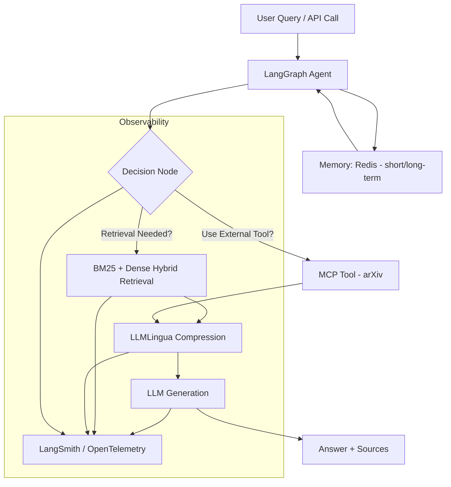
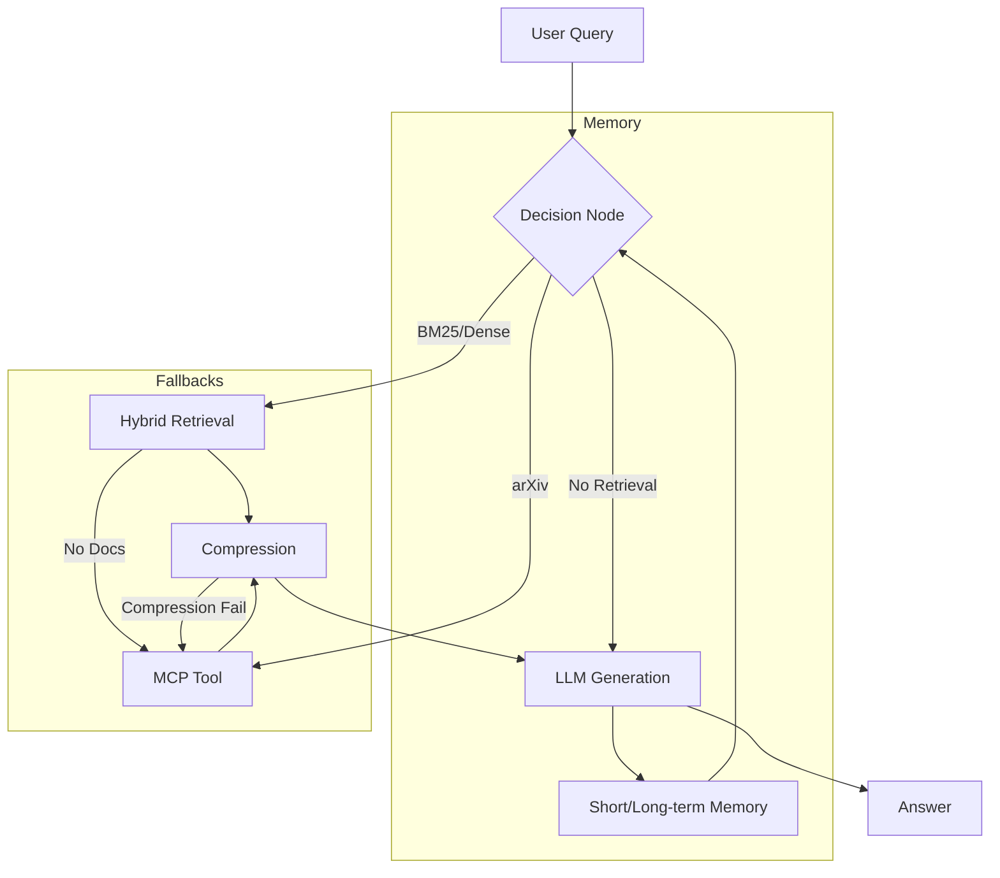

<div align="center">

# 🔍 MemoryForge

### Production-grade Agentic Conversational RAG API for Research Documents

<br/>

[](https://python.org)
[](https://fastapi.tiangolo.com)
[](https://langchain-ai.github.io/langgraph/)
[](https://docker.com)
[](https://redis.io)
[](https://qdrant.tech)
[](LICENSE)

<br/>

**Feed it PDFs. Ask questions. It remembers what you asked before.**

<br/>

> Built with `LangChain` · `LangGraph` · `BM25` · `LLMLingua` · `MCP Tools` · `LangSmith` · `FastAPI` · `Docker` · `Redis` · `Qdrant`

</div>

---

## ✨ What is MemoryForge?

MemoryForge is an **agentic RAG API** that answers questions about research documents — not with a fixed retrieve-then-generate chain, but with a **LangGraph state machine** that:

- 🧠 **Decides** retrieval strategy per query (BM25, dense, or external tool)
- ✂️ **Compresses** context up to 6× before hitting the LLM
- 🌐 **Falls back** to live arXiv search when local index is insufficient
- 💾 **Remembers** full conversation history across sessions via Redis

---

## 🏗️ Architecture

```
User Query → FastAPI
               → LangGraph Agent
                     → load memory         (Redis session history)
                     → BM25 Retriever      (keyword + metadata filter)
                     → LLMLingua           (4–6× context compression)
                     → MCP Tools           (arxiv — when local index insufficient)
                     → LLM                 (GPT-4o-mini / any OpenAI-compatible)
               → Answer + Sources + save turn to memory
```

Async document ingestion — uploads never block the API:

```
POST /ingest → Redis Queue → Worker → BM25 Index (persisted to disk)
```

---

## 🔀 Architecture Diagrams

### Agentic RAG Flow



### Decision Flow & Fallbacks



---

## 🧰 Stack

| Layer | Technology | Why |
|-------|-----------|-----|
| 🌐 API | FastAPI | Async, Pydantic validation |
| 🤖 Agent Orchestration | LangGraph | Stateful decision-making, not a fixed chain |
| 🔍 Retrieval | BM25 (`rank_bm25`) + metadata filtering | Keyword search + filter by year/author/topic |
| ✂️ Context Compression | LLMLingua 2 | 4–6× token reduction before LLM call |
| 💾 Memory | Redis (dual-layer) | Short-term MessagesState + long-term session store |
| 🛠️ External Tools | MCP (arxiv API) | Live paper search when local index is insufficient |
| 📦 Vector Store | Qdrant (ready) | Hybrid BM25 + dense retrieval at scale |
| 📊 Observability | LangSmith + OpenTelemetry | Full agent trace — latency, tokens, retrieval quality |
| 🐳 Deployment | Docker Compose | 4 services: app + worker + redis + qdrant |

---

## 🚀 Quickstart

**Prerequisites:** Docker + Docker Compose, an OpenAI API key, a LangChain API key (for LangSmith tracing).

```bash
# 1. Clone and configure
git clone https://github.com/divyat2605/MemoryForge
cd MemoryForge

# 2. Set your keys
cp .env.example .env
# → Add OPENAI_API_KEY and LANGCHAIN_API_KEY to .env

# 3. Start all 4 services
docker compose up --build
```

API available at **`http://localhost:8000`** · Docs at **`http://localhost:8000/docs`**

> ⚠️ **First run note:** The LLMLingua model (~400MB) downloads on first startup. An extractive fallback activates automatically in the meantime — no code change needed.

---

## 📡 API Endpoints

### `POST /ingest`
Upload a research PDF, TXT, or MD for async indexing.

```bash
curl -X POST http://localhost:8000/ingest \
  -F "file=@attention_is_all_you_need.pdf"

# → { "job_id": "abc123", "status": "queued" }
```

---

### `GET /ingest/status/{job_id}`
Check ingestion progress.

```bash
curl http://localhost:8000/ingest/status/abc123

# → { "status": "done", "chunks": 42, "doc": "attention..." }
```

---

### `POST /query`
Query indexed documents. Pass `session_id` for multi-turn memory.

```bash
curl -X POST http://localhost:8000/query \
  -H "Content-Type: application/json" \
  -d '{
    "query": "What is the transformer attention mechanism?",
    "session_id": "my-session",
    "filters": { "year": "2017" },
    "top_k": 5
  }'
```

Follow-up queries with the same `session_id` retain full conversation context:

```bash
# agent remembers the previous turn
curl -X POST http://localhost:8000/query \
  -d '{"query": "How does that compare to RNN?", "session_id": "my-session"}'
```

---

### `GET /documents`
List all indexed documents and their metadata.

```bash
curl http://localhost:8000/documents
```

---

### `DELETE /memory/{session_id}`
Clear conversation history for a session.

```bash
curl -X DELETE http://localhost:8000/memory/my-session
```

---

## 🧠 Memory Layer

MemoryForge uses a **dual-layer memory system** — Redis is already in `docker-compose`, so this is zero extra infra.

| Layer | Implementation | Scope |
|-------|---------------|-------|
| ⚡ Short-term | LangGraph `MessagesState` | Last 6 turns, in-state per request |
| 🗄️ Long-term | Redis, keyed by `session_id` | Full history, 7-day TTL, survives restarts |

> Redis serves **two roles in one service**: async ingestion job queue + session memory store.

---

## 📊 Observability

Add these to `.env` — zero code changes needed:

```env
LANGCHAIN_TRACING_V2=true
LANGCHAIN_API_KEY=your_key_here
```

LangSmith automatically traces every LangGraph node (`retrieve → compress → generate`), capturing LLM token usage, per-query latency, and retrieval quality across all agent steps.

---

## 📈 Scaling to 1M+ Documents

Current implementation uses in-memory BM25 (`rank_bm25`). Here's the upgrade path:

| Bottleneck | Current | At Scale |
|------------|---------|----------|
| 🔍 Keyword search | `rank_bm25` (in-memory) | **Elasticsearch** — BM25 built-in, distributed |
| 📦 Vector search | Single Qdrant container | **Qdrant cluster** — hybrid BM25 + dense ANN |
| 🌐 API throughput | Single FastAPI instance | `docker compose up --scale app=3` |
| ⚙️ Ingestion speed | Redis queue (async) | Increase worker replicas |

---

## 📁 Project Structure

```
MemoryForge/
├── main.py              # FastAPI — /ingest /query /memory /documents
├── agent.py             # LangGraph state machine — retrieve → compress → generate
├── memory.py            # Dual-layer memory — LangGraph MessagesState + Redis
├── retriever.py         # BM25 keyword search + metadata filtering
├── compressor.py        # LLMLingua context compression + extractive fallback
├── mcp_tools.py         # MCP tool definitions (arxiv search + paper fetch)
├── ingestor.py          # Doc chunking + auto metadata extraction
├── queue_worker.py      # Redis async ingestion worker
├── monitoring.py        # LangSmith + OpenTelemetry tracing
├── Dockerfile
├── docker-compose.yml   # app + worker + redis + qdrant
├── requirements.txt
├── .env.example
├── LICENSE              # Apache 2.0
└── README.md
```

---

## 📄 License

Licensed under the [Apache License 2.0](LICENSE).

---

<div align="center">

Built with ❤️ by [Divya Tripathi](https://github.com/divyat2605)

⭐ Star this repo if you found it useful!

</div>
